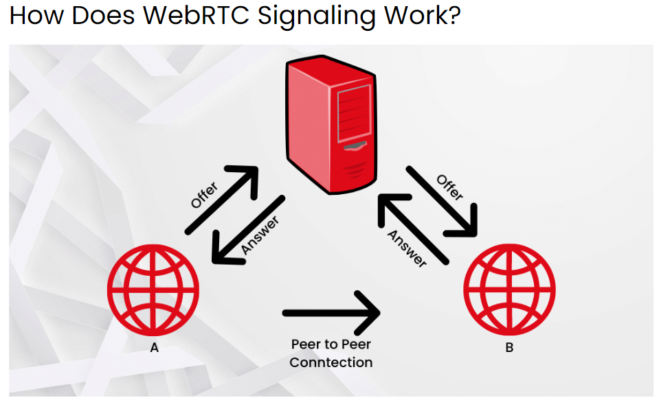
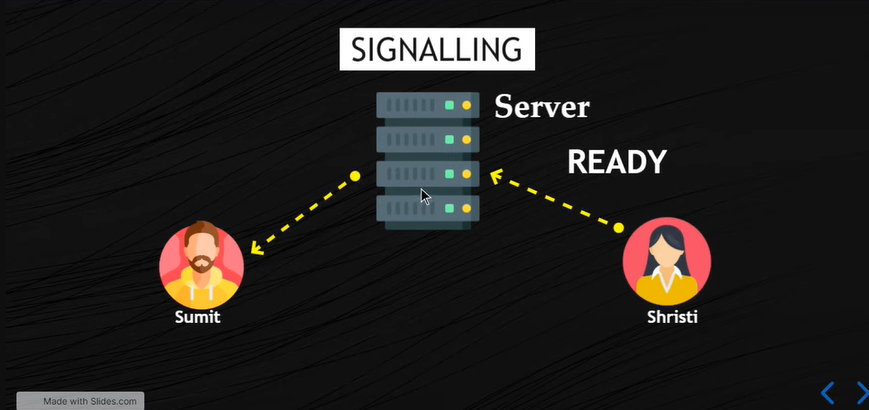
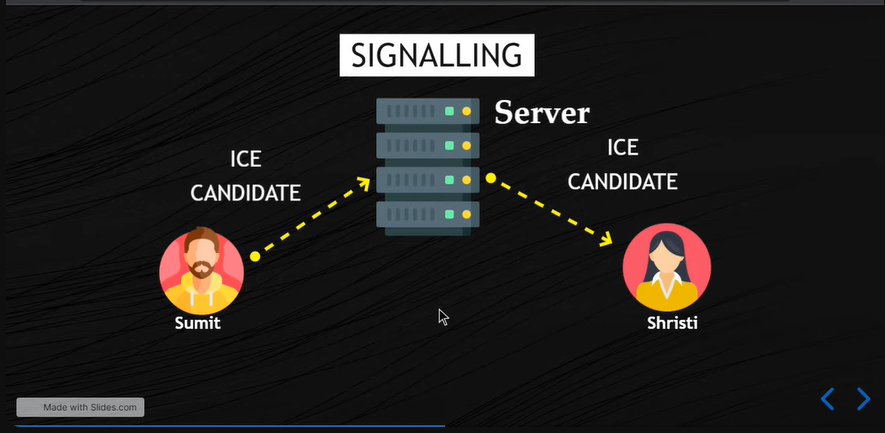
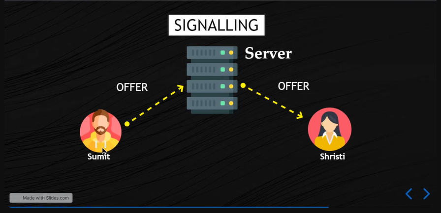

## How does signaling works.


## Making a Signaling Server.



## ice candidate


## offer 


## video to understand signaling in webrtc
<https://youtu.be/eLhpwKtbMuY?si=McyuMMHVlvUt421C>

## blog to understand signaling in webrtc
<https://developer.mozilla.org/en-US/docs/Web/API/WebRTC_API/Signaling_and_video_calling>


## index.js
```javascript
const express = require('express');
const app = express();
const socket = require('socket.io');

const server = app.listen(4040, () => {
  console.log(`SERVER : http://localhost:4040`);
});


const bodyParser = require('body-parser');
app.use(bodyParser.json());
app.use(bodyParser.urlencoded({ extended: true }));

// setting view middleware
app.set('view engine', 'ejs');
app.set('views', './views');

//public folder ko static bana diya 
app.use(express.static('public'));

const userRoute = require('./routes/userRoute');
app.use('/', userRoute);


// socket io working with signaling server
var io = socket(server);
io.on("connection", function (socket) {
  console.log("User Connected:" + socket.id);

  socket.on("join", function (roomName) {
    var rooms = io.sockets.adapter.rooms;
    console.log(rooms);

    var room = rooms.get(roomName);
    console.log(room);
    if (room == undefined) {
      // ye line room create kar raha hai
      socket.join(roomName);
      //jab room created hoga to ik event create hoga 
      socket.emit("created")
      console.log('Room Created');
    }
    else if (room.size == 1) {
      socket.join(roomName);
      socket.emit("joined");

    } else {
      console.log("Room Full Now")
      socket.emit("full")
    }
    console.log(room);
  });

// ye Step 1 hai jaha par ik user request send rarta hai to other via server ki "I am ready to connect" 

//jab server ready hoga jayega to roomName aayega 
  socket.on('ready', function (roomName) {
    console.log("ready");
    socket.broadcast.to(roomName).emit("ready");//client side par catch hoga "ready"
  });


// Ye step 2 hai jaha par candidate connection stablished karte hai via server. connecton ik particular port par stablished hota hai..

  //ik particular port par ice-candidate par 
  socket.on("candidate", function (candidate, roomName) {
    console.log("candidate");
    socket.broadcast.to(roomName).emit("candidate", candidate);
  });


//Ye step 3 hai jaha par offer create hota hai 

  //offer create karege
  socket.on("offer", function (offer, roomName) {
    console.log("offer");
    socket.broadcast.to(roomName).emit("offer", offer)
  })

// ye 4 step hai jab answer dena hota hai connected users ko
  //offer create ke baad answer create karete he
  socket.on("answer", function (offer, roomName) {
    console.log("offer");
    socket.broadcast.to(roomName).emit("answer", answer);
  });

  //
});
```